This page tracks my sports practice data, equipment, and performance analytics over time. The goal is to turn practice into usable feedback: what I shot, what changed, what patterns appeared, and what I should focus on next.

::: {.panel-tabset}

## Archery

### Current Focus

My first tracking area is Olympic recurve archery. I want to record each practice session in a consistent format so I can later analyze score trends, end-by-end consistency, arrow distribution, grouping patterns, and the effects of equipment or technique changes.

### Current Olympic Recurve Setup

::: {.bow-setup-hero}

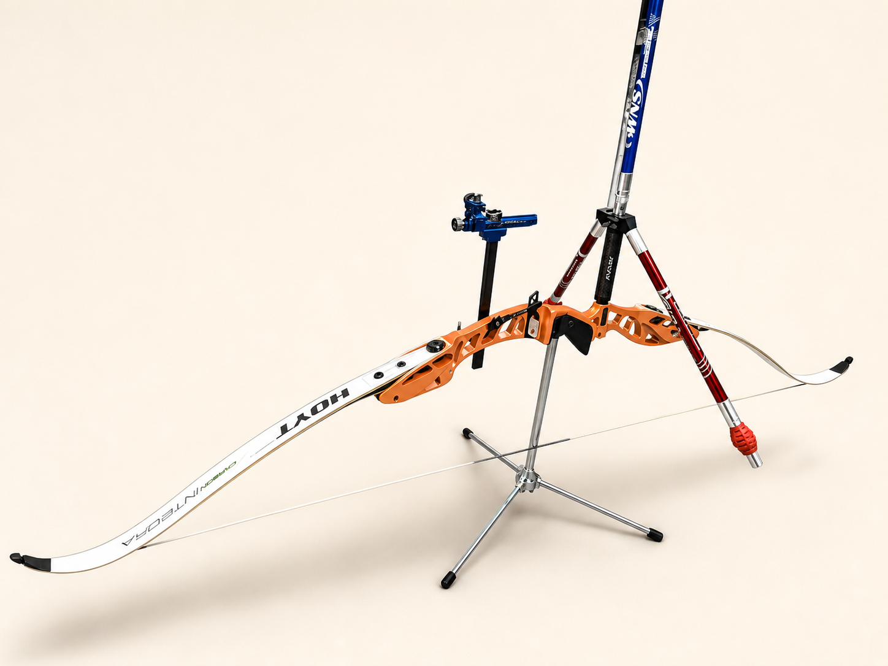

:::

| Component | Current setup | Why it matters |
|---|---|---|
| Riser | Hoyt Formula XD 25" riser | Competition-oriented Olympic recurve platform using the Formula limb system. |
| Limbs | Hoyt RCRV Podium Formula Recurve Limbs, long, 28 lb | Long limbs on a 25" riser create an approximately 70" bow with a smoother draw cycle and more forgiving target-shooting feel. |
| Sight | Axcel Achieve XP Pro Sight | Precision sight system for repeatable Olympic recurve aiming and sight-mark tracking. |
| Stabilizers | WNS stabilizers | Helps improve aiming steadiness, bow balance, and shot reaction consistency. |
| Clicker | AAE Extended Clicker | Supports consistent draw length, expansion, shot timing, and reduced collapse through the shot. |
| Bow stringer | Selway LimbSaver Recurve Stringer, hunter green | Protects the limbs and reduces risk of twist or unsafe stringing. |
| Configuration | Olympic recurve, Formula limb system | Current setup is built for structured target practice and future competition-style training. |

### Why the 28 lb Setup Is Useful

The 28 lb limb setup is a good training choice because it prioritizes clean form over raw draw weight. For Olympic recurve, especially while refining alignment, back tension, expansion, clicker control, and shot timing, a smoother and more manageable setup can lead to better long-term scores than struggling with excessive poundage.

This setup should help me:

- Shoot more arrows per session with less shoulder fatigue.
- Build repeatable expansion through the clicker.
- Improve holding stability and sight picture quality.
- Reduce form breakdown late in practice.
- Increase poundage gradually only after technique becomes consistent.

### Equipment and Tuning Watchlist

These are the next setup variables I should track or confirm as my practice becomes more data-driven:

- Plunger/button model and setting.
- Arrow rest.
- Arrow spine, length, point weight, and fletching.
- Finger tab and anchor consistency.
- Brace height.
- Nocking point height.
- Tiller and limb alignment.
- Stabilizer balance.
- Sight marks by distance.

### Practice Log

All currently logged archery sessions used a 20-yard distance and a Standard Archery Target 40cm 10 Ring Bow and Arrow Target.

| Date | Time | Session | Distance | Target / app label | Ends | Arrows | Reported score | Standard 10-ring score | Avg / Arrow | X |
|---|---:|---|---:|---|---:|---:|---:|---:|---:|---:|
| 2026-05-23 | 3:36 PM | Scorecard app screenshot | 20 yd | 40cm 10-ring target | 6 | 36 | 283 | 283 / 360 (78.6%) | 7.86 | 0 |
| 2026-05-23 | 4:29 PM | Custom-(Lancaster): Preston Leon | 20 yd | 40cm LAS Indoor | 10 | 30 | 237 | 236 / 300 (78.7%) | 7.87 | 1 |
| 2026-05-23 | 5:23 PM | Custom-(WA, Metric): Preston Leon 2 | 20 yd | 40cm WA Target | 3 | 9 | 70 | 70 / 90 (77.8%) | 7.78 | 0 |

[Download archery practice CSV](data/archery_practice_log.csv){.btn .btn-primary}
[View 4:29 PM scorecard PDF](files/sports/archery-2026-05-23-1629-scorecard-preston-leon.pdf){.btn .btn-secondary}
[View 5:23 PM scorecard PDF](files/sports/archery-2026-05-23-1723-scorecard-preston-leon-2.pdf){.btn .btn-secondary}

### Sight Setup Log

The sight setting below was used for the May 23, 2026 practice data at 20 yards. Because the close-up photos preserve the sight geometry better than the small printed dial marks, I am treating the images as the official setup record and only recording numeric values when they can be read clearly.

::: {.sight-setup-note}
**May 23, 2026 sight mark:** Axcel Achieve XP Pro Sight, 20 yards, Standard Archery Target 40cm 10 Ring Bow and Arrow Target. From the closer photos, the side reference scale reads approximately `5.5` visible tick marks, the windage dial appears between `7` and `8` and closest to about `7.8`, and the blue sight-head reference marks appear near the center index. These are photo-based readings, so I should confirm the exact manufacturer units/click values at the range.
:::

| Field | May 23 setup record | Confidence |
|---|---|---|
| Distance | 20 yards | Confirmed |
| Target face | Standard Archery Target 40cm 10 Ring Bow and Arrow Target | Confirmed |
| Sight | Axcel Achieve XP Pro Sight | Confirmed from setup |
| Side reference scale | Approximately `5.5` visible tick marks on the close side scale | Approximate from close-up |
| Windage dial | Between `7` and `8`, closest to about `7.8` on the visible gray dial | Approximate from close-up |
| Windage center index | Blue sight-head reference marks appear close to the center / long middle mark | Photo reference |
| Elevation | Main vertical elevation bar number is not visible in these close-ups; keep the photo set as the current reference and confirm the exact elevation mark next session | Needs range confirmation |
| Aperture position | Aperture mounted on the threaded rod to the archer's right of the blue sight block | Photo reference |

[Download archery sight settings CSV](data/archery_sight_settings.csv){.btn .btn-primary}

::: {.sight-setup-grid}

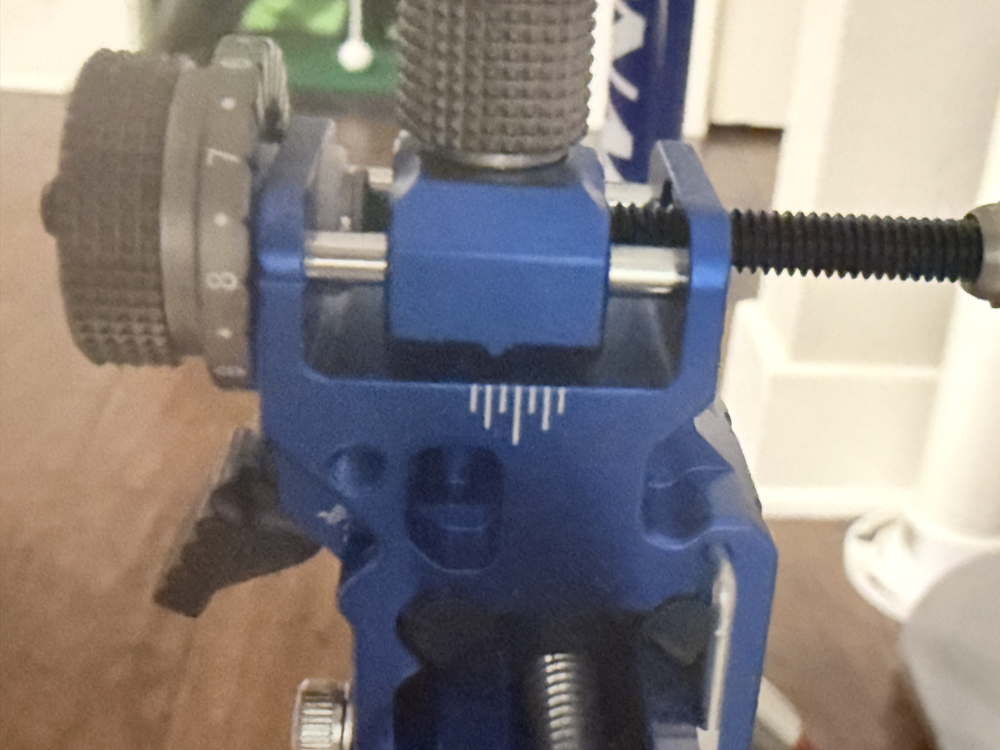

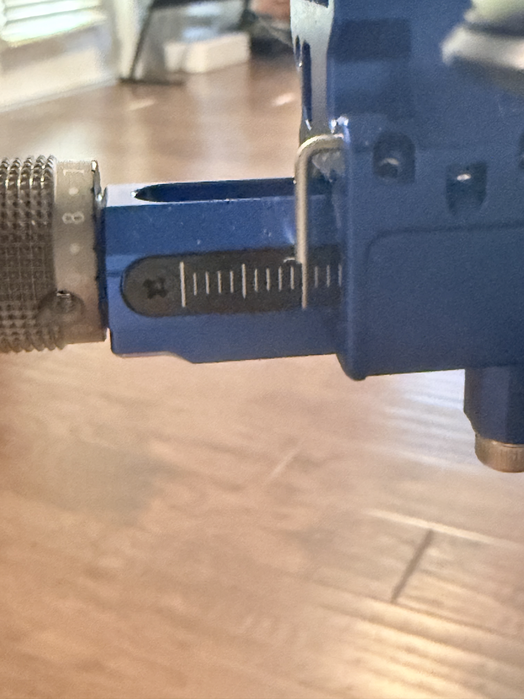

:::

### 2026-05-23 Scorecard-Style Breakdowns

The tables below follow the PDF scorecard structure: each row is one end, each arrow score is shown separately, `Total` is the end total, and `Score` is the cumulative running score.

::: {.score-legend}
**Score color key:** X/10/9 8/7 6/5 4/3 2/1
:::

#### 3:36 PM Scorecard App Screenshot

::: {.archery-scorecard-wrap}
<table class="archery-scorecard">
  <thead>
    <tr class="scorecard-title"><th colspan="10">Distance #1: 20yd (40cm 10 Ring Target)</th></tr>
    <tr><th>End</th><th>1</th><th>2</th><th>3</th><th>4</th><th>5</th><th>6</th><th>Avg.</th><th>Total</th><th>Score</th></tr>
  </thead>
  <tbody>
    <tr><th>1</th><td class="score-yellow">9</td><td class="score-yellow">9</td><td class="score-yellow">9</td><td class="score-red">8</td><td class="score-red">8</td><td class="score-blue">6</td><td>8.17</td><td>49</td><td>49</td></tr>
    <tr><th>2</th><td class="score-yellow">9</td><td class="score-yellow">9</td><td class="score-red">8</td><td class="score-red">8</td><td class="score-blue">6</td><td class="score-white">2</td><td>7</td><td>42</td><td>91</td></tr>
    <tr><th>3</th><td class="score-yellow">9</td><td class="score-yellow">10</td><td class="score-yellow">9</td><td class="score-yellow">9</td><td class="score-blue">5</td><td class="score-yellow">9</td><td>8.5</td><td>51</td><td>142</td></tr>
    <tr><th>4</th><td class="score-yellow">9</td><td class="score-yellow">10</td><td class="score-yellow">9</td><td class="score-red">7</td><td class="score-red">7</td><td class="score-blue">6</td><td>8</td><td>48</td><td>190</td></tr>
    <tr><th>5</th><td class="score-yellow">9</td><td class="score-yellow">9</td><td class="score-red">8</td><td class="score-red">7</td><td class="score-red">8</td><td class="score-blue">6</td><td>7.83</td><td>47</td><td>237</td></tr>
    <tr><th>6</th><td class="score-yellow">9</td><td class="score-yellow">9</td><td class="score-red">7</td><td class="score-red">8</td><td class="score-red">7</td><td class="score-blue">6</td><td>7.67</td><td>46</td><td>283</td></tr>
  </tbody>
</table>
:::

#### 4:29 PM Custom-(Lancaster): Preston Leon

This table follows the attached Lancaster PDF format. The official scorecard reports 237 because this Lancaster-style scorecard counts `X` as 11. For standard 10-ring comparison, the equivalent is 236 / 300.

::: {.archery-scorecard-wrap}
<table class="archery-scorecard">
  <thead>
    <tr class="scorecard-title"><th colspan="7">Distance #1: 20yd (40cm LAS Indoor)</th></tr>
    <tr><th>End</th><th>1</th><th>2</th><th>3</th><th>Avg.</th><th>Total</th><th>Score</th></tr>
  </thead>
  <tbody>
    <tr><th>1</th><td class="score-red">8</td><td class="score-blue">6</td><td class="score-red">7</td><td>7</td><td>21</td><td>21</td></tr>
    <tr><th>2</th><td class="score-blue">6</td><td class="score-blue">6</td><td class="score-blue">6</td><td>6</td><td>18</td><td>39</td></tr>
    <tr><th>3</th><td class="score-yellow">9</td><td class="score-yellow">9</td><td class="score-yellow">9</td><td>9</td><td>27</td><td>66</td></tr>
    <tr><th>4</th><td class="score-blue">6</td><td class="score-red">7</td><td class="score-blue">6</td><td>6.33</td><td>19</td><td>85</td></tr>
    <tr><th>5</th><td class="score-yellow">9</td><td class="score-red">8</td><td class="score-red">8</td><td>8.33</td><td>25</td><td>110</td></tr>
    <tr><th>6</th><td class="score-yellow">10</td><td class="score-red">8</td><td class="score-yellow">9</td><td>9</td><td>27</td><td>137</td></tr>
    <tr><th>7</th><td class="score-yellow">9</td><td class="score-red">8</td><td class="score-red">7</td><td>8</td><td>24</td><td>161</td></tr>
    <tr><th>8</th><td class="score-yellow">9</td><td class="score-yellow">9</td><td class="score-red">7</td><td>8.33</td><td>25</td><td>186</td></tr>
    <tr><th>9</th><td class="score-red">8</td><td class="score-red">8</td><td class="score-red">8</td><td>8</td><td>24</td><td>210</td></tr>
    <tr><th>10</th><td class="score-yellow">X</td><td class="score-red">8</td><td class="score-red">8</td><td>9</td><td>27</td><td>237</td></tr>
  </tbody>
</table>
:::

::: {.archery-scorecard-wrap}
<table class="archery-scorecard archery-summary-table">
  <thead>
    <tr class="scorecard-title"><th colspan="8">Distance #1 Totals - Skill: 59.7</th></tr>
    <tr><th>Xs</th><th>10s</th><th>9s</th><th>Arrow Avg.</th><th>Avg. End</th><th>Score</th><th>Gold</th><th>Xs+10s</th></tr>
  </thead>
  <tbody>
    <tr><td>1</td><td>1</td><td>8</td><td>7.9</td><td>23.7</td><td>237</td><td>33.33%</td><td>2</td></tr>
  </tbody>
</table>
:::

#### 5:23 PM Custom-(WA, Metric): Preston Leon 2

::: {.archery-scorecard-wrap}
<table class="archery-scorecard">
  <thead>
    <tr class="scorecard-title"><th colspan="7">Distance #1: 20yd (40cm WA Target)</th></tr>
    <tr><th>End</th><th>1</th><th>2</th><th>3</th><th>Avg.</th><th>Total</th><th>Score</th></tr>
  </thead>
  <tbody>
    <tr><th>1</th><td class="score-yellow">9</td><td class="score-red">7</td><td class="score-red">7</td><td>7.67</td><td>23</td><td>23</td></tr>
    <tr><th>2</th><td class="score-yellow">9</td><td class="score-red">8</td><td class="score-red">7</td><td>8</td><td>24</td><td>47</td></tr>
    <tr><th>3</th><td class="score-yellow">9</td><td class="score-red">7</td><td class="score-red">7</td><td>7.67</td><td>23</td><td>70</td></tr>
  </tbody>
</table>
:::

::: {.archery-scorecard-wrap}
<table class="archery-scorecard archery-summary-table">
  <thead>
    <tr class="scorecard-title"><th colspan="8">Distance #1 Totals - Skill: 56.9</th></tr>
    <tr><th>Xs</th><th>10s</th><th>9s</th><th>Arrow Avg.</th><th>Avg. End</th><th>Score</th><th>Gold</th><th>Xs+10s</th></tr>
  </thead>
  <tbody>
    <tr><td>0</td><td>0</td><td>3</td><td>7.78</td><td>23.33</td><td>70</td><td>33.33%</td><td>0</td></tr>
  </tbody>
</table>
:::

### Shooting Distribution Pattern

::: {.sports-image-grid}

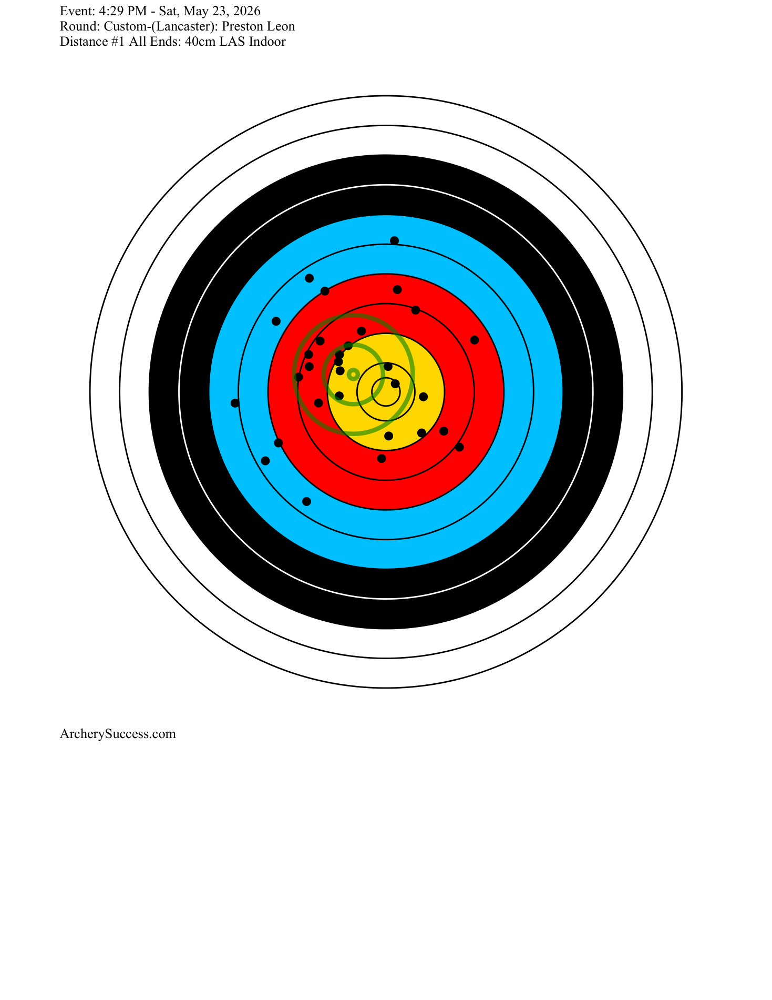

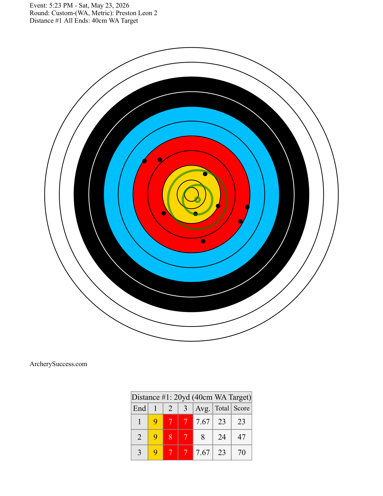

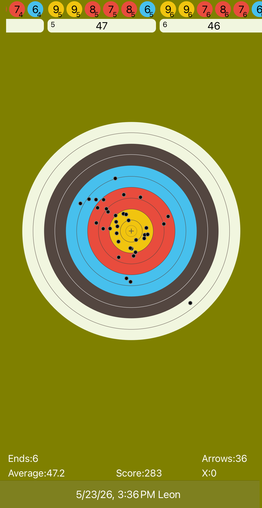

:::

### May 23 Cumulative Analytics

::: {.sports-metric-grid}

::: {.sports-metric-card}
**Standard score**

589 / 750
:::

::: {.sports-metric-card}
**Average arrow**

7.85
:::

::: {.sports-metric-card}
**Total arrows**

75
:::

::: {.sports-metric-card}
**Gold-ring arrows**

30 / 75
:::

:::

Standard 10-ring score distribution across the May 23 data:

| Score value | Count | Share of arrows |
|---:|---:|---:|
| X | 1 | 1.3% |
| 10 | 3 | 4.0% |
| 9 | 26 | 34.7% |
| 8 | 18 | 24.0% |
| 7 | 14 | 18.7% |
| 6 | 11 | 14.7% |
| 5 | 1 | 1.3% |
| 2 | 1 | 1.3% |

Early read:

- Across 75 logged arrows at 20 yards, the standard 10-ring equivalent score is 589/750, or 78.5%.
- The three sessions were consistent by percentage: 78.6%, 78.7%, and 77.8%.
- Gold-ring scoring is the current strength: 30 of 75 arrows were X, 10, or 9.
- The main opportunity is reducing low outliers: 13 of 75 arrows were 6 or lower, including one 2 from the first scorecard screenshot.
- The 4:29 PM scorecard had no misses and a strong official skill rating of 59.7, but it also showed several 6s, so the next quality jump should come from lifting the floor rather than chasing only more 10s.
- The target plots suggest a mild left-side grouping tendency plus occasional low-right outliers; I should confirm this across multiple sessions before changing tuning.

### Future Data Fields

For each future archery practice, I should record:

- Date, time, location, distance, target face, indoor/outdoor conditions.
- Bow setup, limb weight, arrows, plunger setting, brace height, and sight mark.
- Sight photos or exact sight numbers: horizontal extension, elevation, windage, aperture/pin position, and any click changes.
- End-by-end score and raw arrow scores.
- X count, 10 count, 9+ count, and low-arrow count.
- Notes about form, clicker behavior, aiming stability, fatigue, and mental focus.
- A target screenshot or photo when available.

### Next Practice Goal

For the next several sessions, the priority is not only increasing the total score. The first goal is reducing the low outlier arrows while preserving the number of 9s and 10s. A practical target is to keep all arrows at 6 or higher, then push toward all arrows at 7 or higher.

## Golf

### May 22, 2026 Simulator Practice

This session records my driver practice at [Royal Golf Zone](https://www.royalgolfzone.com/) on Friday, May 22, 2026 at 6:00 PM. The screenshots contain 30 unique visible driver shots. I use two views of the data:

- **Raw visible shots:** all 30 transcribed shots from the screenshots.
- **Full-contact subset:** 23 shots with carry at least 150 yards and ball speed at least 100 mph, so obvious mishits or simulator misreads do not dominate the analytics.

[Download visible driver shot CSV](data/golf_simulator_driver_visible_shots.csv){.btn .btn-primary}

| Field | Session record |
|---|---|
| Date and time | 2026-05-22, 6:00 PM |
| Venue | [Royal Golf Zone](https://www.royalgolfzone.com/) |
| Practice type | Indoor golf simulator |
| Club | Driver |
| Visible shots recorded | 30 |
| Full-contact shots analyzed | 23 |
| Units | mph, rpm, yards, degrees |

### Driver Snapshot

::: {.sports-metric-grid}

::: {.sports-metric-card}
**Best total distance**

230 yd
:::

::: {.sports-metric-card}
**Best carry**

217 yd
:::

::: {.sports-metric-card}
**Avg. full-contact distance**

206.2 yd
:::

::: {.sports-metric-card}
**Avg. full-contact carry**

192.2 yd
:::

::: {.sports-metric-card}
**Avg. full-contact ball speed**

122.0 mph
:::

::: {.sports-metric-card}
**Avg. full-contact club speed**

86.3 mph
:::

::: {.sports-metric-card}
**200+ yd total distance**

17 / 23
:::

::: {.sports-metric-card}
**210+ yd total distance**

10 / 23
:::

:::

### Top Recorded Driver Shots

| Shot | Ball speed | Club speed | Carry | Distance | Side angle | Launch / height | Club path | Note |
|---:|---:|---:|---:|---:|---:|---:|---:|---|
| 31 | 133.2 mph | 94.2 mph | 217 yd | 230 yd | -4.9 deg | 13.4 deg | -6.9 deg | Best visible carry and total distance |
| 38 | 129.6 mph | 91.7 mph | 213 yd | 226 yd | -2.4 deg | 15.0 deg | -2.1 deg | Strong long drive |
| 39 | 126.9 mph | 89.7 mph | 210 yd | 222 yd | -0.1 deg | 17.0 deg | 0.0 deg | Best start-line control among long shots |
| 49 | 126.0 mph | 89.1 mph | 205 yd | 218 yd | -3.9 deg | 14.5 deg | 0.0 deg | Solid carry and direction |
| 8 | 127.2 mph | 90.0 mph | 204 yd | 217 yd | -6.0 deg | 12.5 deg | -12.1 deg | Good speed with left-side tendency |
| 26 | 128.2 mph | 90.6 mph | 204 yd | 216 yd | -6.0 deg | 12.8 deg | -19.1 deg | Strong speed, path needs cleanup |
| 55 | 126.2 mph | 89.2 mph | 201 yd | 215 yd | -9.8 deg | 12.3 deg | -2.7 deg | Good power, left start |
| 62 | 122.2 mph | 86.4 mph | 202 yd | 215 yd | 2.1 deg | 19.3 deg | 0.0 deg | High launch with straight path reading |

### Performance Read

- My current driver ceiling is encouraging: the best visible shot reached 230 yards total distance and 217 yards carry, with 133.2 mph ball speed and 94.2 mph club speed.
- The full-contact average was 206.2 yards total distance and 192.2 yards carry, which is a useful baseline for future simulator sessions.
- Contact consistency is the biggest near-term opportunity. Seven visible shots were excluded from the clean subset because they were obvious mishits, weak contacts, or simulator misreads.
- Direction control trends slightly left on the clean shots: 15 of 23 full-contact shots had negative side angle, and the average side angle was -2.2 degrees.
- Several strong shots also showed large negative club-path readings, especially shots 52, 48, 50, 23, and 26. The next practice goal should be narrowing club path and start line before chasing more raw speed.
- Launch/height on full-contact shots averaged 14.2 degrees, with average backspin around 2,740 rpm. That is a usable driver window, but reducing side-spin volatility should improve dispersion.

### Next Golf Practice Goals

- Keep at least 80% of driver shots above 150 yards carry.
- Keep full-contact side angle inside +/-5 degrees.
- Keep club path inside +/-5 degrees on more swings.
- Track whether misses are mostly left-starting, slicing/fading, or contact-related.
- Record the same metrics by club once I begin practicing irons, wedges, and putting.

### Golf Ball Science, GolfTech Best Shots, and Bag Fitting

#### Why Golf Balls Are This Size and Why They Have Dimples

::: {.golf-science-note}
Modern golf balls are standardized for competitive fairness and flight consistency. Under the USGA/R&A equipment rules, a conforming ball must not be smaller than 1.680 inches in diameter and must not be heavier than 1.620 ounces. That size-and-mass envelope keeps the ball large enough to see, strike, and control, while preventing an unfair aerodynamic advantage from a smaller or heavier ball.
:::

The small dents on the ball are dimples, and they are there for aerodynamics rather than decoration. A smooth sphere at golf-ball speed creates a large turbulent wake behind it, which produces high pressure drag and makes the ball slow down quickly. Dimples intentionally disturb the thin boundary layer of air near the ball surface. That turbulent boundary layer stays attached farther around the back of the ball, shrinks the wake, and reduces pressure drag. With backspin, dimples also help the ball generate lift through the Magnus effect, which is why a well-struck driver shot can carry much farther than a smooth ball hit with the same speed.

Practical meaning for my practice: launch angle, spin rate, ball speed, and dimple-driven aerodynamics are tied together. Too much backspin can make the ball climb and lose distance; too little spin can reduce lift and make the ball fall early. For my driver, the goal is not just more ball speed, but a better launch/spin window.

Sources: [USGA Appendix III - The Ball](https://www.usga.org/custom-search-pages/rules/equipment-rules/rule-14611.html), [NASA Glenn on drag of a sphere](https://www1.grc.nasa.gov/beginners-guide-to-aeronautics/drag-of-a-sphere/), and [NASA Glenn on spinning-ball aerodynamic force](https://www.grc.nasa.gov/www/k-12/VirtualAero/BottleRocket/airplane/beach.html).

#### GolfTech Driver Best Shots - May 27, 2026

These are my best two driver shots from last night's GolfTech practice. The 207-yard shot was the longest total distance, while the 206-yard shot had the better carry and smash factor.

| Shot | Total | Carry | Ball speed | Club speed | Launch | Backspin | Descent | Max height | Smash | Offline | Read |
|---:|---:|---:|---:|---:|---:|---:|---:|---:|---:|---:|---|
| 17 / 17 | 207 yd | 187 yd | 132 mph | 89 mph | 9 deg | 3661 rpm | 27 deg | 14 yd | 1.47 | 11 yd | Longest total distance; good speed, but launch was low and spin was high. |
| 10 / 10 | 206 yd | 190 yd | 127 mph | 84 mph | 16 deg | 3167 rpm | 40 deg | 24 yd | 1.50 | 40 yd | Best carry and smash factor; launch was in the target range, but dispersion needs work. |

::: {.sports-metric-grid}

::: {.sports-metric-card}
**Best total**

207 yd
:::

::: {.sports-metric-card}
**Best carry**

190 yd
:::

::: {.sports-metric-card}
**Best smash factor**

1.50
:::

::: {.sports-metric-card}
**Top ball speed**

132 mph
:::

:::

::: {.sports-image-grid}

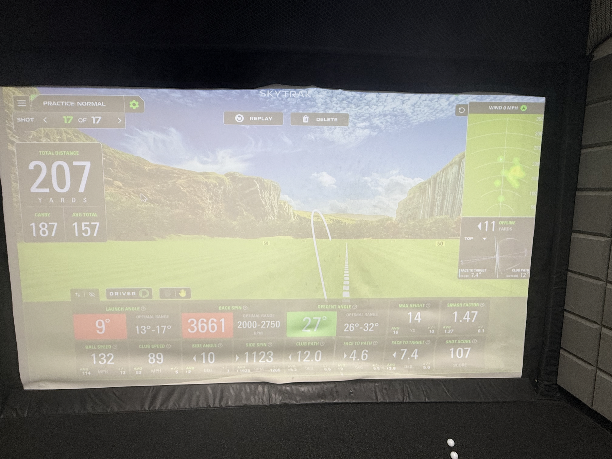

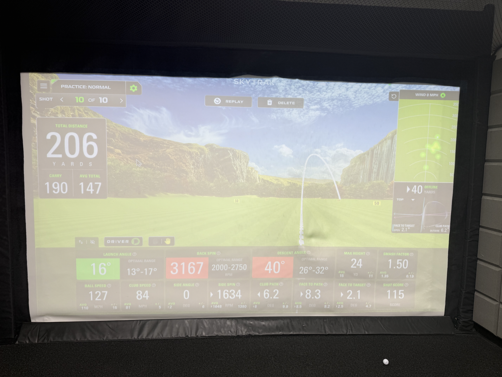

:::

#### Current Golf Bag Fitting Setup

The table below records my current recommended bag setup from the club-fitting screenshots. The 7 iron and pitching wedge are treated as iron-set fitting anchors; I can expand this once the full iron set is finalized.

[Download current golf bag fitting CSV](data/golf_club_bag_fitting_2026-05-28.csv){.btn .btn-primary}

| Bag slot | Head | Loft / lie | Length | Shaft | Grip | Notes |
|---|---|---|---|---|---|---|
| Driver | TaylorMade Qi35 Max | 10.5 loft; adapter 0.75 up | 45 in; standard 45.75 in | Fujikura Speeder NX TCS 50 R | Golf Pride MCC Plus 4, Gray/Blue, standard | Shorter-than-standard driver build for control. |
| 7 Iron | Callaway Elyte Max Fast | 30 loft; 60.75 lie; 1.0 up | 37.5 in | Mitsubishi Vanquish 40 R2 | Golf Pride MCC Plus 4, Gray/Blue, standard | Iron fitting reference. |
| Pitching Wedge | Callaway Elyte Max Fast | 43 loft; 60.75 lie; 1.0 up | 35.75 in | Mitsubishi Vanquish 40 R2 | Golf Pride MCC Plus 4, Gray/Blue, standard | Iron set wedge reference. |
| 56 Wedge | TaylorMade Milled Grind 5 Satin Chrome | 56/10/SC; 64 lie | 35.75 in; standard 35.25 in | Dynamic Gold Tour Issue 115 Wedge | Golf Pride MCC Plus 4, Gray/Blue, standard, +2 wraps | Slightly longer wedge with extra grip wraps. |
| Putter | Callaway Ai-ONE Silver Seven DB | 3 loft; 70 lie | 36 in | Odyssey SL 90 Putter Shaft | Callaway Ai-ONE Slim Pistol, white, putter size | Face-balanced style setup for putting stability. |

### Simulator Screenshot Gallery

::: {.sports-image-grid}

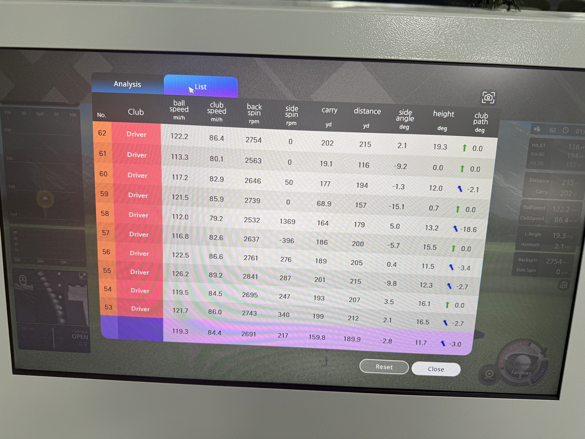

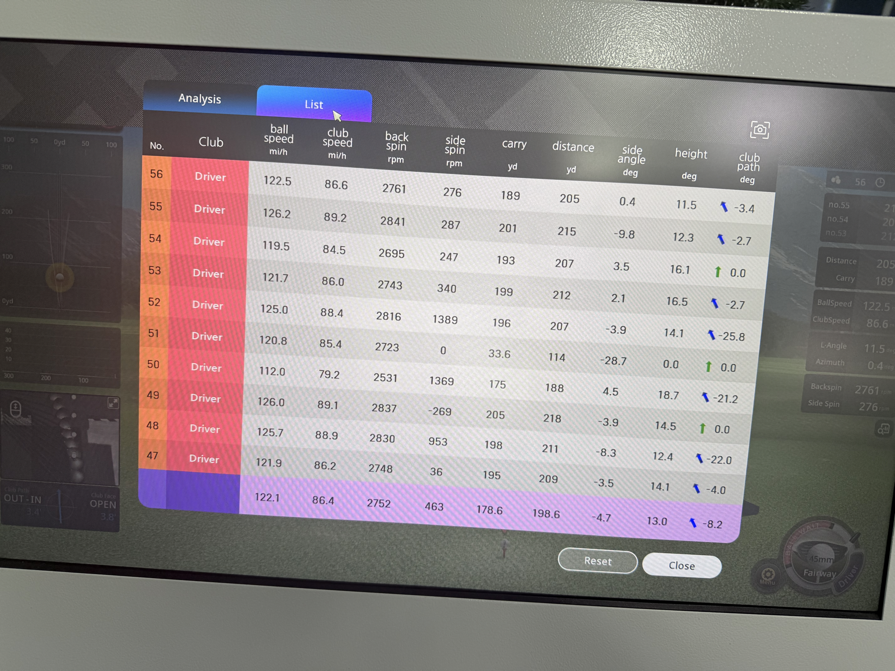

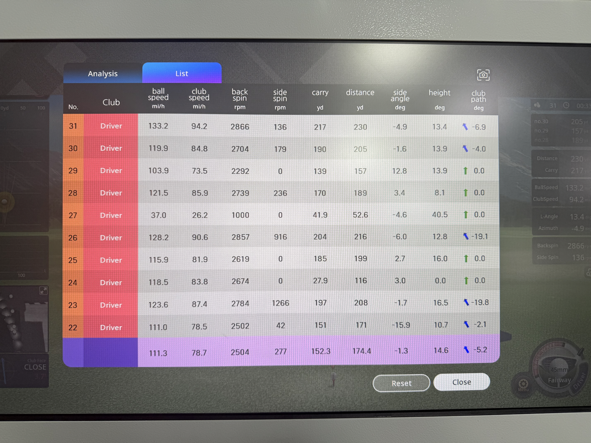

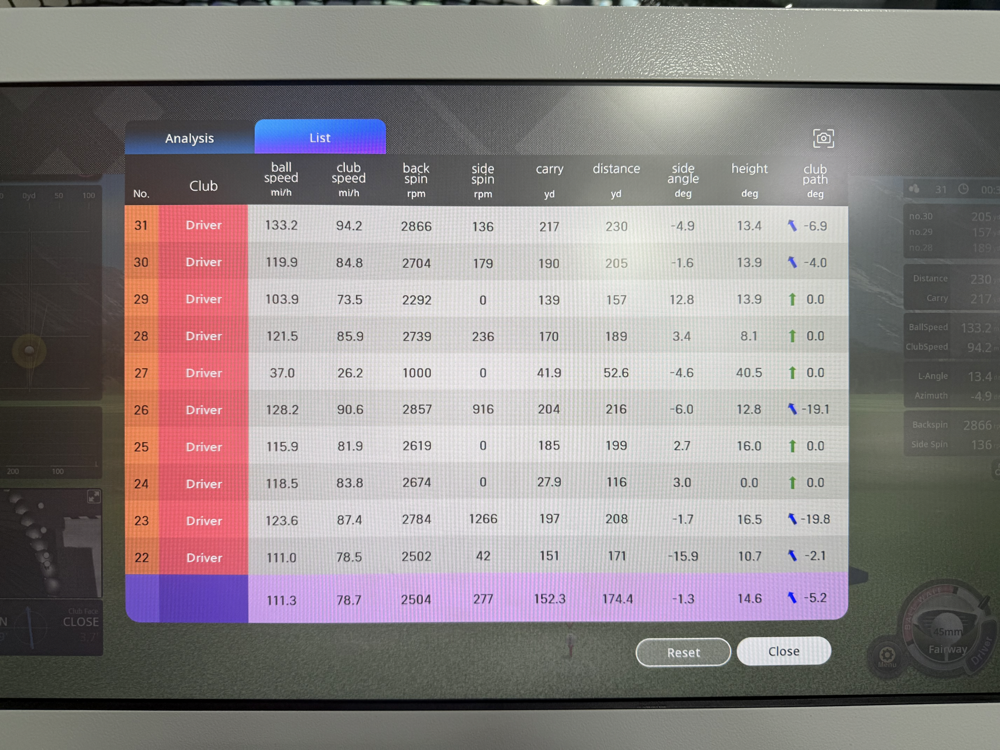

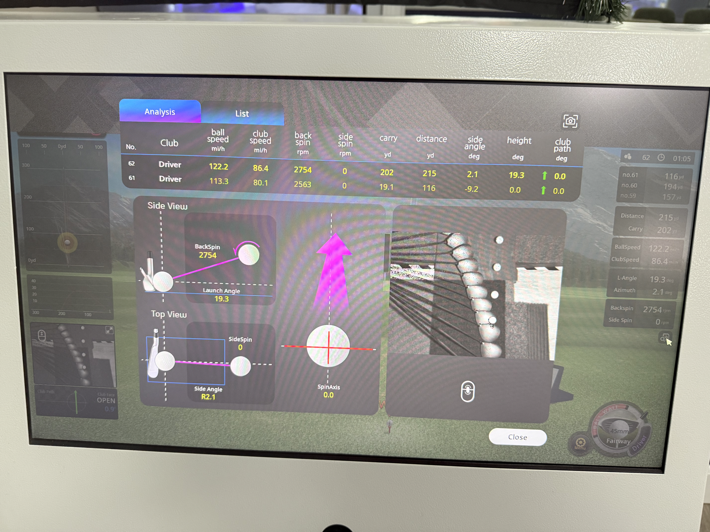

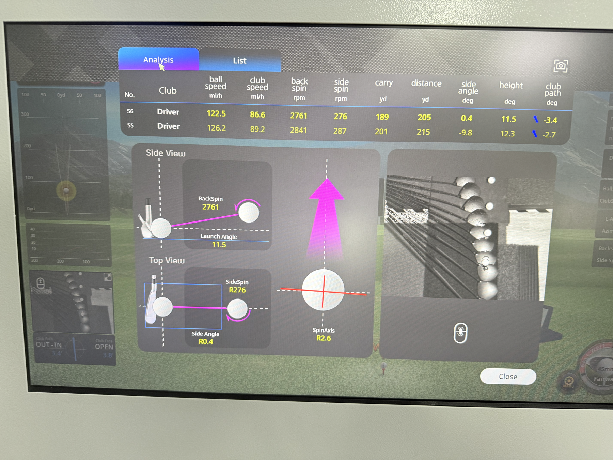

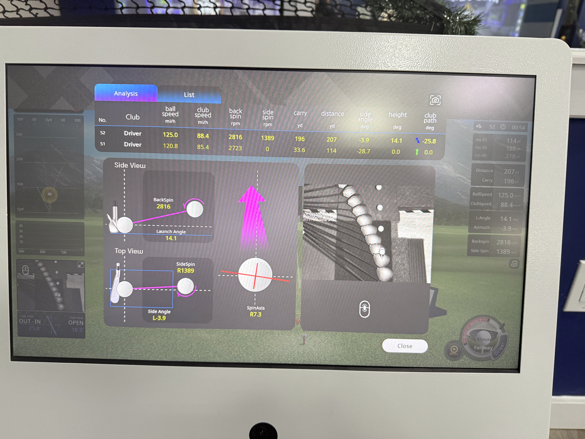

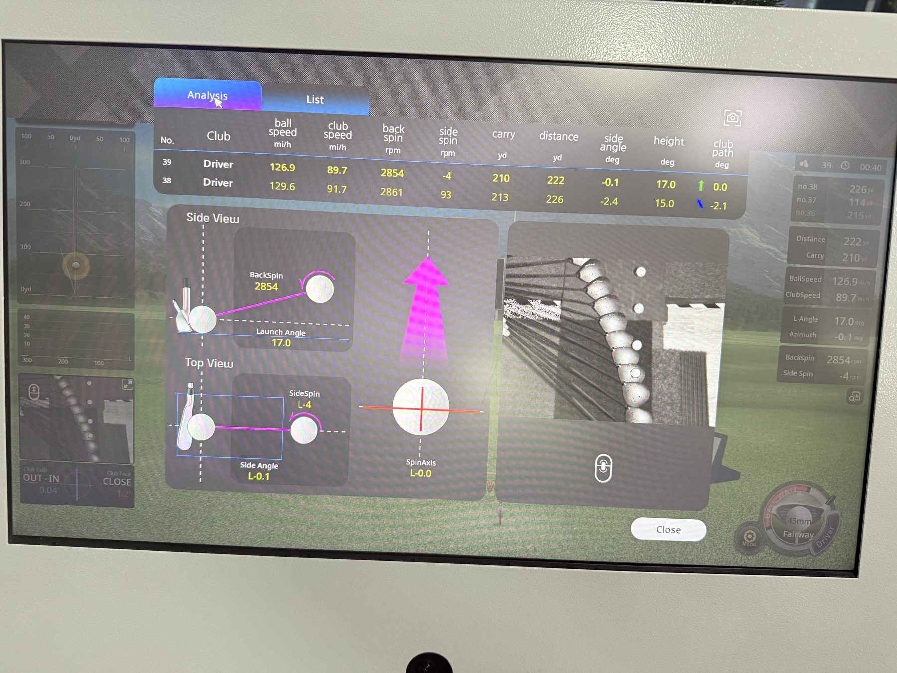

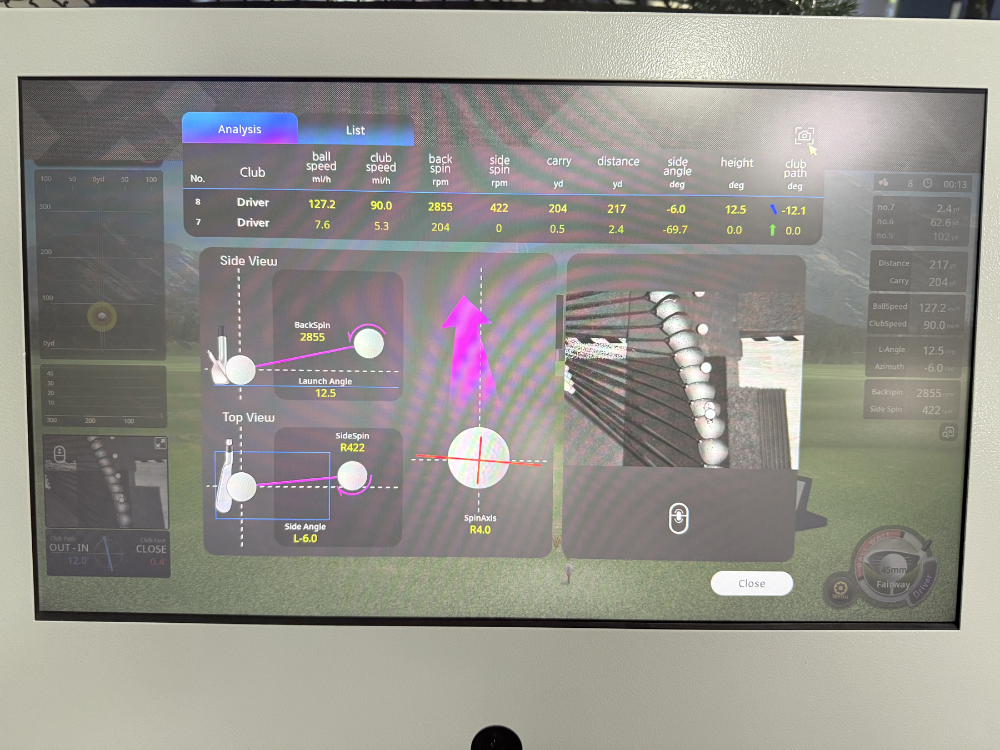

:::

## Cycling

### Road Bike Cycling Tracker

This section tracks my road bike training, Garmin ride summaries, White Rock Lake route practice, and future cycling-performance analytics. The current goal is to build a repeatable log for distance, speed, heart rate, cadence, climbing, temperature, and training notes.

::: {.cycling-training-note}
**Data note:** the current Garmin CSV exports are lap/summary files, not full second-by-second GPS/FIT records. They are enough for ride-level analytics and lap comparison. For route replay, map traces, power curves, and time-series plots, I should also export `.fit`, `.gpx`, or `.tcx` files from Garmin Connect.
:::

### Bike and Tracking Setup

| Category | Current setup | What it supports |
|---|---|---|
| Road bike | Trek **Domane SL 5 Gen 4** | Endurance road bike built for long miles, rough roads, and comfort-focused training. |
| Frame | 500 Series OCLV Carbon | Lightweight endurance frame platform with comfort and stability as priorities. |
| Drivetrain | Shimano 105 | Reliable road drivetrain for structured training and general performance riding. |
| Wheels / cockpit | Aluminum wheels and aluminum handlebars | Balanced performance and value; good baseline before future upgrades. |
| GPS computer | Garmin **Edge 840 Bundle** | Touchscreen + button cycling computer for navigation, ride planning, workout prompts, and performance tracking. |
| Sensors | Speed Sensor 2, Cadence Sensor, HRM-Dual | Enables speed, cadence, and heart-rate tracking independent of only GPS estimates. |
| Current device status | Edge 840 software `30.18`; Speed Sensor 2 software `4.10`; sensor battery OK | Establishes a setup baseline for future ride logs. |
| Future upgrade path | Compatible power meter | Would unlock Garmin power guide, stamina insights, cycling ability classification, and more complete adaptive coaching. |

[Watch Trek Domane SL 5 Gen 4 intro video](https://www.youtube.com/watch?v=6zvzwqUwtIw){.btn .btn-primary}
[Download cycling ride summary CSV](data/cycling_ride_summary.csv){.btn .btn-secondary}
[Download cycling lap summary CSV](data/cycling_lap_summary.csv){.btn .btn-secondary}

Garmin Edge 840 capabilities I want to use as this tracker grows:

- Navigation and ride planning with touchscreen and button control.
- Multi-band GNSS for better location accuracy in more challenging environments.
- Daily suggested workouts, training prompts, and missed-workout reminders.
- ClimbPro ascent planning to monitor remaining ascent and grade during climbs.
- Ride-type maps that highlight popular roads, trails, and searchable points of interest.
- Power guide, stamina insights, and cyclist ability/course-demand classification once I add a compatible power meter.

### Garmin CSV Summary

The current dataset contains six Garmin activity exports from the `cycling` folder. Because the CSV exports do not include ride dates, I use Garmin activity IDs and ride order as the tracking identifiers for now.

::: {.sports-metric-grid}

::: {.sports-metric-card}
**Logged rides**

6
:::

::: {.sports-metric-card}
**Total distance**

54.76 mi
:::

::: {.sports-metric-card}
**Total elapsed time**

4:00:02
:::

::: {.sports-metric-card}
**Total moving time**

3:41:14
:::

::: {.sports-metric-card}
**Moving avg speed**

14.85 mph
:::

::: {.sports-metric-card}
**Avg heart rate**

125 bpm
:::

::: {.sports-metric-card}
**Total ascent**

1,226 ft
:::

::: {.sports-metric-card}
**Total calories**

2,168
:::

:::

::: {.cycling-table-wrap}

| Ride | Garmin activity ID | Distance | Time | Moving time | Avg speed | Moving avg | Avg HR | Avg cadence | Ascent | Max speed | Notes |
|---:|---:|---:|---:|---:|---:|---:|---:|---:|---:|---:|---|
| 1 | 22109798266 | 9.12 mi | 41:28 | 38:14 | 13.2 mph | 14.3 mph | 119 bpm | 62 rpm | 174 ft | 21.6 mph | Dallas road cycling activity |
| 2 | 22176079934 | 9.12 mi | 44:54 | 35:59 | 12.2 mph | 15.2 mph | 113 bpm | 66 rpm | 190 ft | 23.3 mph | Dallas road cycling activity |
| 3 | 22301153174 | 10.03 mi | 42:56 | 39:56 | 14.0 mph | 15.1 mph | 131 bpm | 61 rpm | 236 ft | 23.8 mph | Longest current logged ride |
| 4 | 22311683203 | 9.18 mi | 38:30 | 37:24 | 14.3 mph | 14.7 mph | 131 bpm | 62 rpm | 226 ft | 24.4 mph | Fastest max speed |
| 5 | 22366655913 | 9.25 mi | 39:29 | 38:01 | 14.1 mph | 14.6 mph | 131 bpm | 61 rpm | 259 ft | 23.5 mph | White Rock Lake ride from screenshot |
| 6 | 23073973446 | 8.06 mi | 32:45 | 31:40 | 14.8 mph | 15.3 mph | 128 bpm | 66 rpm | 141 ft | 23.4 mph | Best current average speed |

:::

### White Rock Lake Baseline Ride

The White Rock Lake ride shown in the Garmin screenshot is activity `22366655913`: 9.25 miles in 39:29, with 14.1 mph average speed, 14.6 mph moving average speed, 131 bpm average heart rate, 61 rpm average cadence, and 259 ft total ascent.

::: {.cycling-visual-grid}

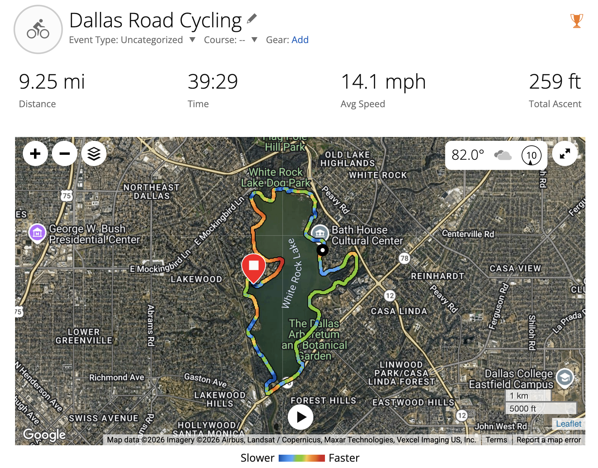

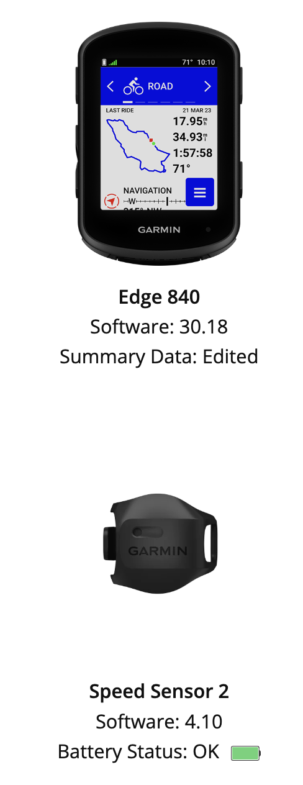

:::

### Cycling Analytics

::: {.cycling-visual-grid}

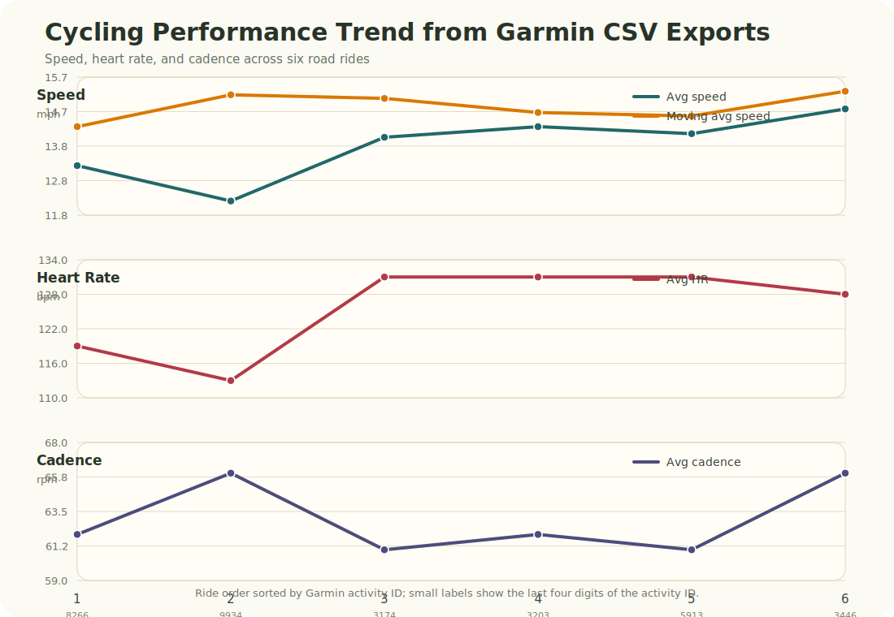

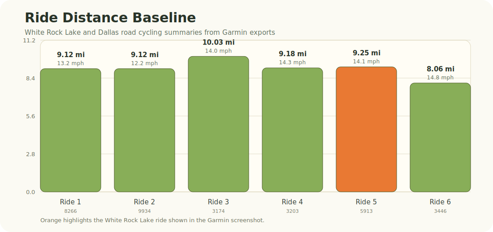

:::

Early read from the Garmin data:

- Across six logged rides, the current training baseline is about 55 miles total, with a weighted moving average speed of 14.85 mph.
- Moving speed is more stable than elapsed speed. This means stops, traffic, intersections, or route interruptions are affecting elapsed pace more than riding pace.
- The strongest current average-speed ride is activity `23073973446` at 14.8 mph elapsed average and 15.3 mph moving average.
- The longest current ride is activity `22301153174` at 10.03 miles.
- The highest-climbing current ride is the White Rock Lake activity `22366655913` with 259 ft of ascent.
- Average cadence is currently around 63 rpm. A useful future focus is tracking whether smoother cadence work, bike fit, and route choice can gradually raise comfortable cadence while keeping heart rate controlled.
- Heart rate rose from the first two rides into the 128-131 bpm range on later rides, while speed also improved. That suggests later rides were more sustained training efforts rather than only casual cruising.

### Future Cycling Data Fields

For each future ride, I should record:

- Date, start time, route name, weather, temperature, wind, and traffic/stop context.
- Bike used, tire pressure, sensor status, and whether the HRM-Dual was connected.
- Distance, elapsed time, moving time, average speed, moving average speed, max speed.
- Average heart rate, max heart rate, average cadence, max cadence, calories, ascent, and descent.
- Optional future power metrics: average power, normalized power, power zones, training stress, stamina, and power-guide targets.
- Subjective notes: perceived effort, comfort, fueling, hydration, saddle/fit issues, and one next-ride focus.

## Flight Training

This section tracks my Private Pilot License training flights, ForeFlight debriefs, route history, and flight-performance patterns over time. The goal is to make each lesson reviewable: where I flew, how the altitude and speed profile looked, what ForeFlight scored well, and what I should focus on in the next flight.

::: {.flight-training-note}
**Training review only:** these plots and logs are for personal learning and post-flight analysis. They are not for navigation, dispatch, or operational flight planning.
:::

::: {.panel-tabset}

### Flight Log

#### ForeFlight Track Log: KSEP to KFTW

This entry uses the downloaded ForeFlight CSV/KML track log and the ForeFlight navlog PDF from my February 22, 2026 training flight.

| Field | Record |
|---|---|
| Date | February 22, 2026 |
| Route | KSEP -> KFTW |
| Aircraft | N2236W, P28A - PA-28-161 Warrior II |
| Track window | 4:46:52 PM to about 6:20 PM CST |
| ForeFlight debrief score | 98 overall, 100 maneuvers, 97 approaches |
| Planned navlog distance | 73 NM |
| Actual track distance | 84.8 NM |
| Track duration | 1:33:30 |
| Planned cruise altitude | 3,500 ft |
| Maximum recorded altitude | 3,495 ft MSL |
| Maximum ground speed | 116.5 kt |
| Moving average ground speed | 95.4 kt, using samples with ground speed at least 30 kt |

[Download flight journal CSV](data/flight_training_log.csv){.btn .btn-primary}
[Download sampled track CSV](data/flight_2026-02-22_track_samples_15s.csv){.btn .btn-secondary}
[Download raw ForeFlight CSV](files/sports/flight/foreflight-2026-02-22-tracklog.csv){.btn .btn-secondary}
[Download raw KML](files/sports/flight/foreflight-2026-02-22-tracklog.kml){.btn .btn-secondary}
[View ForeFlight navlog PDF](files/sports/flight/foreflight-2026-02-22-navlog.pdf){.btn .btn-secondary}
[Open shared ForeFlight debrief](https://plan.foreflight.com/shared/debrief/track/b00b9008-962e-415f-b88c-1b375792dd6d){.btn .btn-secondary}

::: {.sports-metric-grid}

::: {.sports-metric-card}
**Overall score**

98
:::

::: {.sports-metric-card}
**Track distance**

84.8 NM
:::

::: {.sports-metric-card}
**Duration**

1:33:30
:::

::: {.sports-metric-card}
**Max altitude**

3,495 ft
:::

::: {.sports-metric-card}
**Max GS**

116.5 kt
:::

::: {.sports-metric-card}
**Moving avg GS**

95.4 kt
:::

:::

### Track Visuals

::: {.flight-visual-grid}

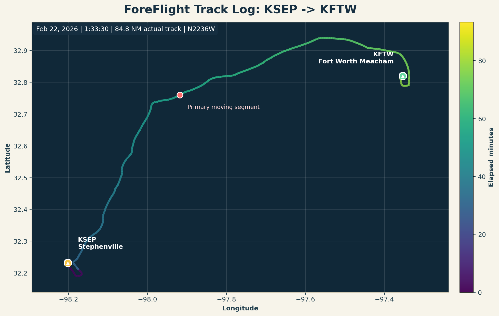

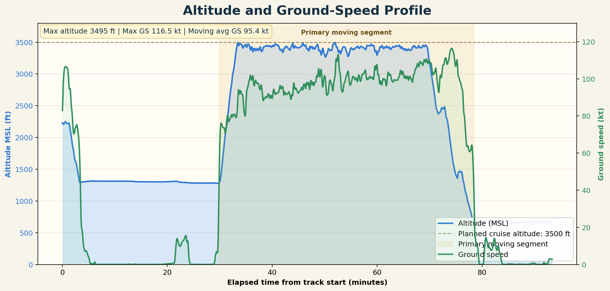

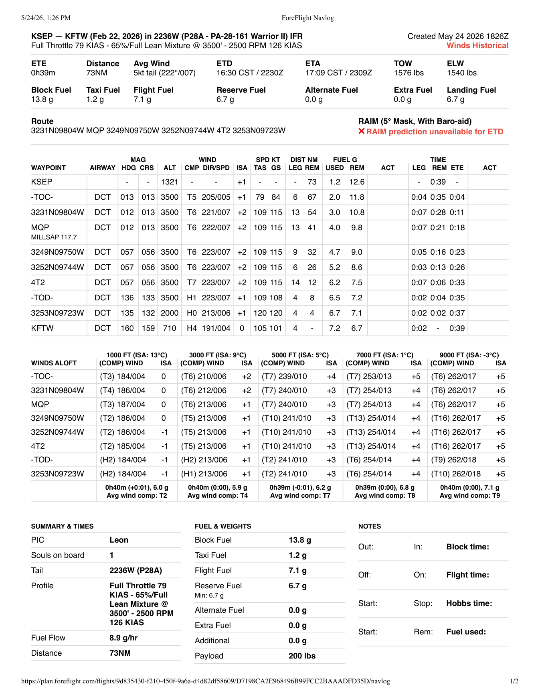

:::

### Training Read

The first data read from this flight is encouraging:

- ForeFlight scored the lesson strongly: 98 overall, with 100 for maneuvers and 97 for approaches.
- The planned navlog route was 73 NM, while the downloaded track totals 84.8 NM. That difference is expected because the track log includes the full recorded path and any extra maneuvering, holding, taxi, or setup portions.
- The main cruise profile stayed close to the planned 3,500 ft target, with a maximum recorded altitude of 3,495 ft MSL.
- Moving samples averaged 95.4 kt ground speed, and the maximum recorded ground speed was 116.5 kt.
- The altitude/ground-speed profile is the most useful training plot because it shows level-off quality, cruise steadiness, descent timing, and approach-energy management in one view.

### Journal System

For future PPL training flights, this page should track both the official logbook facts and the learning notes:

| Category | Fields to record |
|---|---|
| Flight identity | Date, aircraft tail, aircraft type, route, origin, destination, instructor, lesson number |
| Logbook data | Total time, dual received, PIC if applicable, landings, day/night, cross-country, simulated instrument |
| ForeFlight debrief | Overall score, maneuvers score, approaches score, route image, altitude profile, ground-speed profile |
| Training content | Maneuvers practiced, pattern work, radio work, navigation tasks, checklist discipline |
| Reflection | What improved, what felt unstable, what to ask the instructor, next-flight focus |
| Data files | ForeFlight CSV, KML, navlog PDF, screenshots, notes, weather context |

As more flights are added, I can turn this into a real flight-training dashboard with monthly hours, airports visited, landing counts, maneuver history, route maps, and milestone progress toward the Private Pilot License.

:::

:::
