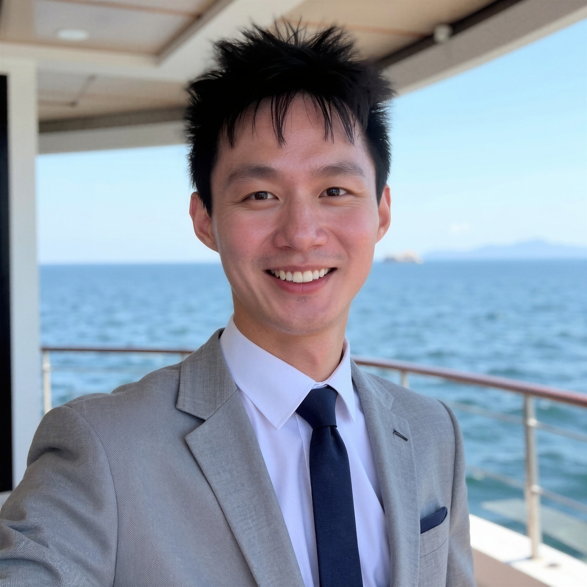

:::: {.publications-layout}

::: {.publications-manuscripts}

I am interested in teaching statistics, probability, data science, and statistical computing. My goal as an instructor is to help students develop statistical thinking, computational skills, and the ability to connect quantitative methods with real-world problems.

## Teaching Interests

- Introductory Statistics
- Probability
- Mathematical Statistics
- Regression Analysis
- Time Series Analysis
- Bayesian Statistics
- Statistical Computing with R and Python
- Data Science and Machine Learning

## Teaching Experience

### Graduate Teaching Assistant  
**STAT 2331: Introduction to Statistical Methods**  
**Department of Statistics and Data Science, Southern Methodist University**  
**August 2025 – December 2025**

I served as a Graduate Teaching Assistant for STAT 2331, a non-calculus-based introduction to statistical methods. The course introduced students to statistical reasoning, descriptive statistics, probability concepts, simple linear regression, inference, and the use of statistics in decision-making.

My responsibilities included supporting students’ understanding of statistical concepts, helping clarify homework and course materials, assisting with grading, and guiding students in applying statistical methods to practical examples. Through this teaching experience, I developed a stronger appreciation for explaining technical ideas in clear and accessible language.

### Graduate Teaching Assistant  
**STAT 3300: Applied Statistics: Regression**  
**Department of Statistics and Data Science, Southern Methodist University**  
**August 2022 – May 2023**

I served as a Graduate Teaching Assistant for STAT 3300, an applied statistics course focused on regression methods and statistical modeling. The course introduced students to topics such as simple and multiple linear regression, model interpretation, diagnostic checking, inference for regression coefficients, prediction, and applications of regression models to real data.

My responsibilities included supporting students with course concepts, assisting with homework and statistical software questions, helping students understand regression output, and contributing to grading and instructional support. This experience strengthened my ability to explain statistical modeling ideas clearly, especially the connection between mathematical formulas, computational output, and practical interpretation.

## Mentoring and Student Support

As a graduate student in statistics, I enjoy helping students build confidence in quantitative reasoning. I aim to make statistics less intimidating by explaining ideas step by step, using visual intuition, and connecting formulas with real data examples.

I am especially interested in helping students learn how to use statistical software such as R and Python to explore data, fit models, interpret results, and communicate findings clearly.

::: {.mentorship-program}
### Undergraduate Mentorship - SMU Data Analytics Club

**Spring 2026 | Individual meetings by Zoom or in person**

Through the SMU Data Analytics Club Mentorship Program, I mentor three undergraduate students in individual sessions. We use a flexible meeting schedule to discuss career development and schoolwork connected with each student's major, interests, and goals.

Our mentorship conversations may include:

- Career and internship exploration, recruiting strategy, interview preparation, networking, resume review, and professional development.
- Major exploration, technical skill development, strategies for succeeding in classes, and broader academic guidance.
- Research, student organizations, and other opportunities at SMU, along with general guidance for navigating college life.

<strong>Bloom Wu</strong>
<a href="mailto:bloomw@smu.edu">bloomw@smu.edu</a>

<strong>Vj Singh</strong>
<a href="mailto:viraajs@smu.edu">viraajs@smu.edu</a>

<strong>Marshall Minor</strong>
<a href="mailto:mminor@smu.edu">mminor@smu.edu</a>

:::

## Teaching Philosophy

My teaching goal is to help students understand statistical thinking, not only memorize formulas. I believe effective statistics teaching should combine mathematical foundations, computational practice, and real-world interpretation.

In the classroom, I aim to:

- Explain statistical concepts clearly and intuitively.
- Connect theory with real data applications.
- Encourage students to ask questions and think critically.
- Use computation to deepen understanding.
- Help students interpret statistical results in practical contexts.

I want students to leave my courses not only knowing how to calculate statistical quantities, but also understanding what those quantities mean, when to use them, and how to communicate their conclusions responsibly.

:::

::::
